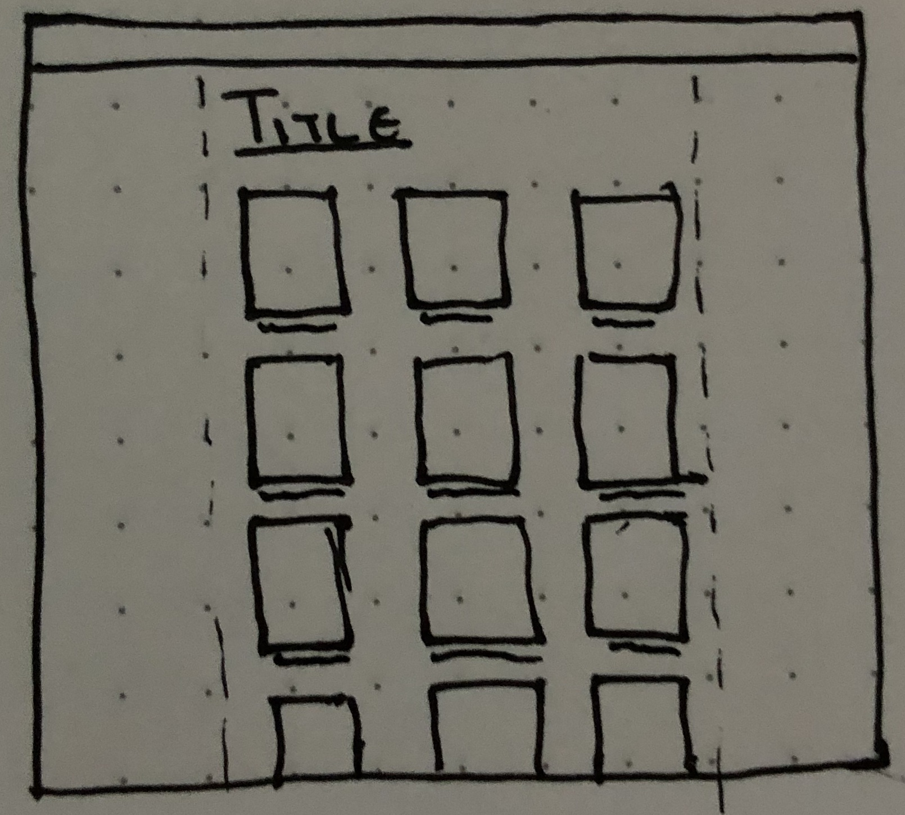

# Single Collage View to Display Multiple Models

## Status
Accepted

## Context
There is a large similarity between several different views for displaying the Catalogue (view of all books), Collection List (view of all user created collections), and a Collection (view of all books added to a collection). All of these views will consist of thumbnails with a brief description (typically title) for their assets as outlined in the following figure:

## Decision
To reduce duplicated code the mentioned views will be represented using a single CollageView. This view will be fed the data to display by the CatalogueController, CollectionListController, and CollectionsController. As all instances of thumbnails will be a book cover or artwork, plus a title, the appropriate controller can instruct the view to display a list of any of the appropriate items.

## Consequences
In the original design decision, a collection of books would show the artwork, title, author, and average rating of each book. As these are not necessarily relevant to the catalogue view they become harder to implement and will require some additional effort to implement.
