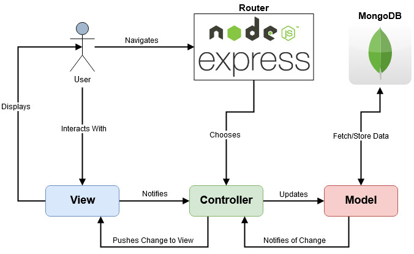

# Milestone 2: Design Overview
This document serves as an overview of the software architecture and design of the APP_TITLE app. 

# Table of Contents
- [Milestone 2: Design Overview](#milestone-2-design-overview)
- [Table of Contents](#table-of-contents)
- [Architecture Overview](#architecture-overview)
  - [Views, Controllers, and Models](#views-controllers-and-models)
  - [Sequence Diagram](#sequence-diagram)
  - [Toolsets, Infrastucture, and Deployment](#toolsets-infrastucture-and-deployment)
- [Architecture Decision Records](#architecture-decision-records)
- [Miscellaneous](#miscellaneous)

# Architecture Overview

Our application follows the Model View Controller architecture, utilizing MongoDB for persisting data, and Express.JS to handle routing. Though not reflected in the below diagram, our views will be modeled using Pug.JS as a templating engine (see [ADR: Template Engine](#architecture-decision-records)).

In our design implementation, the model does not talk directly to view components, instead always relying on data flow through the controller itself (see [ADR: View Data Flow](#architecture-decision-records)).

## Views, Controllers, and Models
A more thurough walkthrough and description of all planned models, views, and controllers for our application is shown below.

This diagram outlines the interactions of different controllers with their respective views, as well as showing how a view can interact with a seperate controller when necessary (outlined in detail with a [sequence diagram](#sequence-diagram)). Models do not have all necessary characteristics, but have most information they will carry present. 

This diagram illustrates the design flow we have chosen to ensure all QAs from milestone 1 are able to be met. For example, the implementation of the catalogue controller will allow it to fetch only relevant data (Title, Author, and Cover) of books, and will support pagination with ChangeViewables(). This will allow the design target of 700ms load times to be met.

## Sequence Diagram

To better capture the flow and interactions between application components a sequence diagram was created walking through a User leaving a comment on a book.

## Toolsets, Infrastucture, and Deployment
Our application will make use of the following toolsets:
* PugJS Template Engine
* Express.JS/Node.JS
* JEST
* Selenium
* JMeter
* Travis CI
* Docker
* MongoDB

Our application will be setup to run in a containerized environment using Docker. While not part of this project scope, this decision was influenced by the ability to implement scaling easily in the future by implementing the container to Kubernetes.

The core of the application outlined in the diagrams above is being written in Typescript utilizing Express.JS for application routing. To meet the our QAS realted to testability, this project will utilize 3 testing suites:
* JEST - Automatically run Unit Tests upon commit by TravisCI
* Selenium - Automatically run Interaction Tests by TravisCI
* JMeter - Manually run Performance Tests to ensure performance requirements met

CI/CD of the application will be handled using TravisCI. TravisCI will allow us to implement the automated testing and deployment of the app following these steps:
1. Developer makes a commit
2. TravisCI pulls the commit
3. Travis runs automated tests for the application
4. Upon successfull testing, the application is built and packaged into a Docker container
5. The docker container is deployed to a host to be run

# Architecture Decision Records
* [Collage View vs. Multiple Views](ArchitecturalDecisionRecords/ADR-CollageView.md)
* [Using Pug.JS as a Template Engine](ArchitecturalDecisionRecords/ADR-PugJS.md)
* [Relying on the Controller to pass data to the View](ArchitecturalDecisionRecords/ADR-MVC.md)
* [Using Travis instead of Jenkins for Deployment](ArchitecturalDecisionRecords/ADR-Jenkins.md)

  

# Miscellaneous
This section outlines various other resources used while creating the design.

A wireframe mockup of most application views was completed:

A listing of [Use Cases](UseCases.md) was created with walkthroughs.

A [ER Style diagram](assets/erdiagram.png) was created to show a rough schema the database will follow. This may not align entirely with the design outlined above, but was created first as a base structure.
